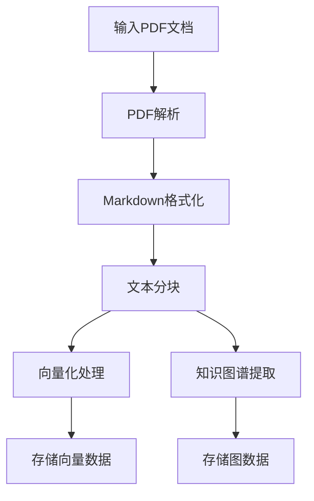
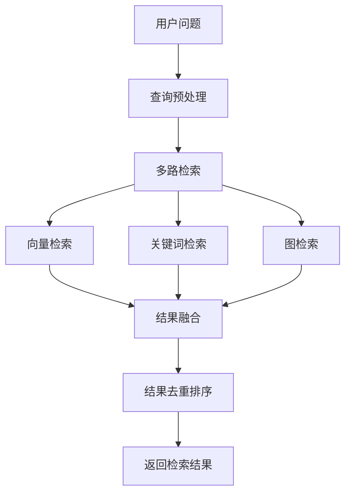
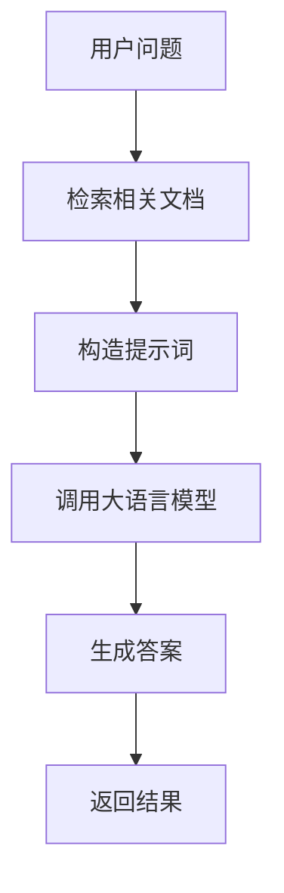

# RAG Backend 架构设计说明

## 1. 项目概述

RAG Backend 是一个基于检索增强生成（Retrieval-Augmented Generation）技术的知识问答系统，主要用于处理和回答基于特定文档内容的问题。当前实现专注于华为基本法文档的索引和问答功能。

## 2. 系统架构

### 2.1 整体架构图

```
┌─────────────────┐    ┌──────────────┐    ┌────────────────┐
│   用户接口层     │    │   应用服务层  │    │   数据存储层    │
├─────────────────┤    ├──────────────┤    ├────────────────┤
│  CLI命令行接口   │───▶│  编排服务     │───▶│  向量数据库     │
│  RESTful API    │    │  索引服务     │    │  (Neo4j)       │
└─────────────────┘    │  检索服务     │    └────────────────┘
                       │  生成服务     │          ▲
                       │  预处理服务   │          │
                       │  后处理服务   │          │
                       └──────────────┘    ┌─────────────┐
                                           │  图数据库    │
                                           │  (Neo4j)    │
                                           └─────────────┘
```

### 2.2 核心组件

#### 2.2.1 主要模块

1. **主入口模块** (`main.py`)
   - 提供CLI命令行接口
   - 支持索引、搜索、聊天三大功能
   - 参数解析和命令分发

2. **API服务模块** (`api.py`)
   - 提供RESTful API接口
   - 支持健康检查、搜索、聊天功能

3. **编排服务** (`src/orchestration.py`)
   - 协调各个子服务的工作流程
   - 统一对外提供索引、搜索、聊天接口

4. **索引服务** (`src/indexing.py`)
   - 文档解析（PDF转文本）
   - 文本分块处理
   - 向量化处理
   - 知识图谱提取

5. **检索服务** (`src/retrieval.py`)
   - 多种检索策略（向量检索、关键词检索、图检索）
   - 结果融合和去重

6. **生成服务** (`src/generation.py`)
   - 基于检索结果生成答案

7. **预处理服务** (`src/pre_retrieval.py`)
   - 查询扩展和优化

8. **后处理服务** (`src/post_retrieval.py`)
   - 检索结果重排序

## 3. 数据流设计

### 3.1 索引流程



### 3.2 检索流程



### 3.3 问答流程



## 4. 核心数据结构

### 4.1 主要数据类

1. **Chunk** - 文本块
   ```python
   @dataclass
   class Chunk:
       content: str
       metadata: Optional[Dict[str, Any]] = None
   ```

2. **VectorRecord** - 向量记录
   ```python
   @dataclass
   class VectorRecord:
       content: str
       embedding: Sequence[float]
       metadata: Optional[Dict[str, Any]] = None
   ```

3. **GraphEdge** - 图边
   ```python
   @dataclass
   class GraphEdge:
       source: str
       relation: str
       target: str
       weight: float = 1.0
   ```

4. **RetrievalResult** - 检索结果
   ```python
   @dataclass
   class RetrievalResult:
       content: str
       score: float
       metadata: Optional[Dict[str, Any]] = None
   ```

5. **GenerationResult** - 生成结果
   ```python
   @dataclass
   class GenerationResult:
       answer: str
       citations: List[RetrievalResult]
   ```

## 5. 技术栈

### 5.1 核心技术

- **Python 3.12** - 主要编程语言
- **LangChain** - LLM应用开发框架
- **Neo4j** - 图数据库存储
- **DashScope** - 阿里云百炼平台API
- **Qwen** - 通义千问大语言模型

### 5.2 依赖库

- `langchain-core` - LangChain核心库
- `langchain-community` - LangChain社区库
- `langchain-text-splitters` - 文本分割工具
- `langchain-openai` - OpenAI集成
- `pypdf` - PDF处理
- `python-dotenv` - 环境变量管理
- `neo4j` - Neo4j驱动
- `numpy` - 数值计算
- `rapidfuzz` - 字符串模糊匹配
- `fastapi` - Web框架
- `uvicorn` - ASGI服务器

## 6. 数据存储设计

### 6.1 Neo4j图数据库设计

#### 6.1.1 节点类型

1. **Collection** - 文档集合
   - 属性：name（集合名称）

2. **Chunk** - 文本块
   - 属性：cid（块ID）、content（内容）、embedding（向量）

#### 6.1.2 关系类型

1. **IN** - 文本块属于集合
2. **RELATION** - 实体间的关系
   - 属性：type（关系类型）、weight（权重）

#### 6.1.3 索引设计

1. **文本索引**
   - collection_name_index：Collection节点的name属性
   - chunk_cid_index：Chunk节点的cid属性

2. **向量索引**
   - chunk_embedding_index：Chunk节点的embedding属性

## 7. API设计

### 7.1 CLI接口

```bash
# 索引文档
python main.py indexing --name codex-gpt51 --file ../documents/华为基本法.pdf

# 搜索信息
python main.py search --name codex-gpt51 --question "华为基本法的主要内容" --top-k 5 --expand_query true --rerank true --use_vector true --use_graph true

# 聊天交互
python main.py chat --name codex-gpt51 --question "华为基本法的主要内容" --top-k 5 --expand_query true --rerank true --use_vector true --use_graph true
```

### 7.2 RESTful API

1. **POST /search** - 搜索接口
2. **POST /chat** - 聊天接口
3. **GET /health** - 健康检查

## 8. 部署架构

### 8.1 环境要求

- Python 3.12+
- Neo4j数据库
- DashScope API访问权限

### 8.2 配置文件

- `.env` - 环境变量配置
- `pyproject.toml` - 项目依赖管理

### 8.3 启动方式

```bash
# 安装依赖
uv sync

# 启动CLI
uv run python main.py --help

# 启动API服务
uvicorn api:app --host 0.0.0.0 --port 8000
```

## 9. 评估与测试

### 9.1 测试集生成

使用Ragas框架自动生成测试集，包含：
- 不同用户角色的问答对
- 多种问题类型覆盖

### 9.2 评估指标

1. **Correctness** - 正确性
2. **Faithfulness** - 忠实度
3. **Answer Relevance** - 答案相关性
4. **Context Precision** - 上下文精度
5. **Context Recall** - 上下文召回率

## 10. 扩展性设计

### 10.1 模块化设计

各功能模块高度解耦，便于独立扩展和维护：
- 索引模块可替换不同文档解析器
- 检索模块支持多种检索策略
- 生成模块可接入不同大语言模型

### 10.2 配置化设计

通过环境变量和参数配置实现灵活部署：
- 支持不同的LLM提供商
- 可配置的检索策略组合
- 可调整的文本分块参数

### 10.3 插件化设计

预留扩展接口：
- 支持新增检索算法
- 支持新的文档格式
- 支持更多的后处理策略